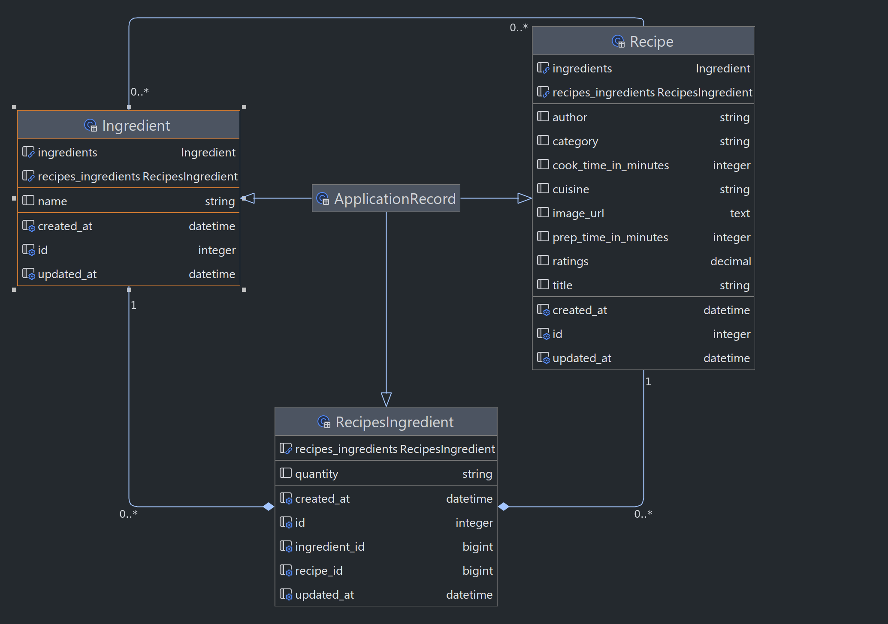

# BitsAndBites - Find delicious recipes that you can cook right now! 🍜


Available at: https://bits-and-bites.fly.dev/

This is a fully-dockerized Rails 7 & React web application that helps you not to starve! 🤤
You can search for ingredients you have on hand, and BitsAndBites will suggest a myriad of recipes for you to cook using those ingredients.

BitsAndBites was built using:

- Ruby: `3.2.1`
- Rails: `7.0.8`
- React: `18.2.0`
- PostgreSQL: `15.3`
- Docker: `20.10.5` & Docker-compose: `1.25.0`

(and DALL·E 3 for this beautiful logo! 🤖)

## Table of Contents

- [Introduction](#introduction)
- [User Stories](#user-stories)
- [Prerequisites](#prerequisites)
- [Setup](#setup)
- [Running the application](#running-the-application)
- [Running tests](#running-tests)
- [Endpoints](#endpoints)
- [Sample Requests and Responses](#sample-requests-and-responses)
- [Database Schema](#database-schema)
- [Project Structure](#project-structure)
- [Troubleshooting](#troubleshooting)
- [Wrapping Up](#wrapping-up)

## Introduction

BitsAndBites comes as a solution to the following challenge:

> It's dinner time ! Create an application that helps users find the most relevant recipes that they can prepare with the ingredients that they have at home.

## User Stories

### User Story #1

> As a user, I want to be able to search for recipes by ingredients, so that I can find recipes that I can cook right now.

### User Story #2

> As a user, I want to be able to see the list of ingredients for each recipe, so that I can make sure I have all the ingredients I need.

### User Story #3

> As a user, I just want to browse recipes, so that I can find something that looks delicious. Then I can go out and buy the ingredients I need.

## Prerequisites

Ensure you have Docker and Docker Compose installed on your machine.

- To install Docker, follow the instructions here: https://docs.docker.com/engine/install/

- To install Docker Compose, follow the instructions here: https://www.digitalocean.com/community/tutorials/how-to-install-and-use-docker-compose-on-ubuntu-20-04#step-1-installing-docker-compose (as it is tested using the `docker-compose` v1. Alternatively, you could try v2 version from here: https://docs.docker.com/compose but I am not sure about the `docker-compose.yml` compatibility)

All the actual application dependencies are handled by Docker. Check `Dockerfile` and `docker-compose.yml` files for more info on that.

## Setup

1. **Clone the repository:**

    ```bash
    git clone git@github.com:christospi/bits-and-bites.git
    ```

2. **Navigate to the application directory:**

    ```bash
    cd bits-and-bites
    ```

3. **Environment configuration:**
The application uses environment variables for configuration. A `.env.sample` file is provided in the repository as a template.
    1. Copy the `.env.sample` file to create a new `.env` file:

        ```bash
        cp .env.sample .env
        ```

    2. Open the `.env` file in a text editor and replace the placeholder values with your actual values... **OR**
    3. <details>
        <summary>Use mine... 🤫🔫🔪</summary>

        ```
        # Database config
        POSTGRES_DB=bits_and_bites_development
        POSTGRES_HOST=localhost
        POSTGRES_USER=ratatouille
        POSTGRES_PASSWORD=linguine
        POSTGRES_PORT=5432

        # Rails config
        RAILS_ENV=development
        RAILS_MASTER_KEY=7202648ae149c3c955cd24439faaf2af
        ```
    </details>
4. **Build and start the Docker containers:**

    ```bash
    docker-compose up --build
    ```

    The database will be prepared automatically during the startup process.


## Running the application

Once the Docker containers are up and running, BitsAndBites will be available at `http://localhost:3000`
You can import the sample dataset by running the following command:

```bash
docker-compose exec web rake recipes:import_small
```

or import the full dataset by running the following command:

```bash
docker-compose exec web rake recipes:import_all
```

## Running tests

To run the test suite, execute the following command:

```bash
docker-compose -f docker-compose.test.yml up --build
```

This will build and start the Docker containers and run all the `rspec` tests.

## Endpoints

The API exposes the following endpoints:

- `GET /recipes`: Returns a list of recipes sorted by ratings descending, with the most recent users appearing first. Supports optional parameters for filtering and pagination. Currently supported optional parameters:
    - `keyphrase`: A comma separated string of ingredients to search recipes for.
    - `page`: The page number to return. Defaults to 1.

    For a few samples, check the following section (Sample Requests and Responses).


## **Sample Requests and Responses**

This section provides examples of how to call the supported endpoints and what kind of responses you can expect.

### **Get Recipes**

**Request:**

```bash
curl -X GET http://localhost:3000/api/v1/recipes/index
```

**Response:**

This endpoint returns a list of recipes, including ingredients.
The response contains an array of Recipe objects. Each Recipe object includes **`id`**, **`title`**, **`cookTimeInMinutes`**, **`prepTimeInMinutes`**,
**`ratings`**, **`category`**, **`cuisine`**, **`author`**, **`imageUrl`**, and **`ingredients`** attributes.

```json
{
  "recipes": [
    {
      "id": 10011,
      "title": "Sloppy Does",
      "cookTimeInMinutes": 20,
      "prepTimeInMinutes": 10,
      "ratings": "5.0",
      "category": "Venison Recipes",
      "cuisine": "",
      "author": "Zacktheperson",
      "imageUrl": "https://imagesvc.meredithcorp.io/v3/mm/image?url=https%3A%2F%2Fimages.media-allrecipes.com%2Fuserphotos%2F1578799.jpg",
      "ingredients": [
        {
          "id": 27,
          "name": "olive oil",
          "quantity": "1 teaspoon"
        },
        {
          "id": 2845,
          "name": "ground venison",
          "quantity": "1 pound"
        }, // ... more ingredients
      ]
    },
  // ... more records
  ],
  "meta": {
    "totalPages": 100
  }
}
```

You can also use query parameters to filter and paginate the results. Here's an example that fetches the first page of Recipes that include the ingredients "milk" and "sugar":

**Request:**

```bash
curl -X GET "http://localhost:3000/api/v1/recipes/index?keyphrase=milk%2C+sugar&page=1"
```

This request will return the following response:

```json
{
  "recipes": [
    {
      "id": 7051,
      "title": "Homemade Sweetened Condensed Milk",
      "cookTimeInMinutes": 10,
      "prepTimeInMinutes": 5,
      "ratings": "4.21",
      "category": "Everyday Cooking",
      "cuisine": "",
      "author": "lauren11",
      "imageUrl": "https://imagesvc.meredithcorp.io/v3/mm/image?url=https%3A%2F%2Fimages.media-allrecipes.com%2Fuserphotos%2F1387465.jpg",
      "ingredients": [
        {
          "id": 3,
          "name": "white sugar",
          "quantity": "1 ½ cups"
        },
        {
          "id": 1948,
          "name": "can evaporated milk",
          "quantity": "1 (12 fluid ounce)"
        }
      ]
    }
  ],
  "meta": {
    "totalPages": 1
  }
}
```

## Database Schema

The database schema is defined in `db/schema.rb` file. It contains the following tables:



## Project Structure

The project follows a typical Rails application structure with models, controllers, and services.

- **Services:** Located in `app/services` directory, these files encapsulate business logic related to models, letting us have quite thin models. This includes the `RecipeSearchService` class used to search recipes by ingredients.
- **Serializers:** Located in the `app/serializers` directory, these files handle the conversion of data for application models. It contains `RecipeSerializer` which is responsible for serializing `Recipe` records along with their `Ingredients`, in order to be returned by the API (and consumed by the React frontend).
- **Rake tasks:** Located in the `lib/tasks` directory, these files contain the rake tasks for importing recipes from the provided JSON files. It includes `import_recipes.rake` which is responsible for importing recipes from the provided JSON files.
- **React frontend:** Located in the `app/javascript` directory, these files contain the React frontend for the application. Every component is located in its own directory. It includes `App` which is responsible for rendering the application, `Home` which is responsible for rendering the home page, `Recipes` which is responsible for rendering a list of recipes and `RecipeSearch` which is responsible for rendering the search form.
- **Specs:** Test coverage is provided by RSpec. Located in the `spec` directory, these files contain the test suite for our application, including unit tests for models, controller actions and services.
- **Dockerfile and docker-compose.yml:** These files define the Docker configuration for setting up and running the application in a Docker container. It handles both our database (Postgres), Rails app and React.
- **.env.sample:** Sample configuration files for the required environment variables. Following the instructructions in **Setup** section, you should create a new local file named `.env` in application root directory with the appropriate values.

## **Troubleshooting**

If you encounter issues while setting up the application, you may need to rebuild your Docker images:

```bash
docker-compose down
docker-compose up --build
```

You may also need to check the container logs to debug any issues:

```bash
docker-compose logs
```

## Wrapping Up 🙏

That was a blast! 🚀 Really enjoyed putting this together – it's not every day you get to juggle with recipes, ingredients, and Docker all at the same time!

I hope you enjoy checking it out as much as I did building it. And if there's anything that made you go "hmm" or "huh?" (of course there will be!), I'm all ears. Always keen to learn and grow.

Thanks!
